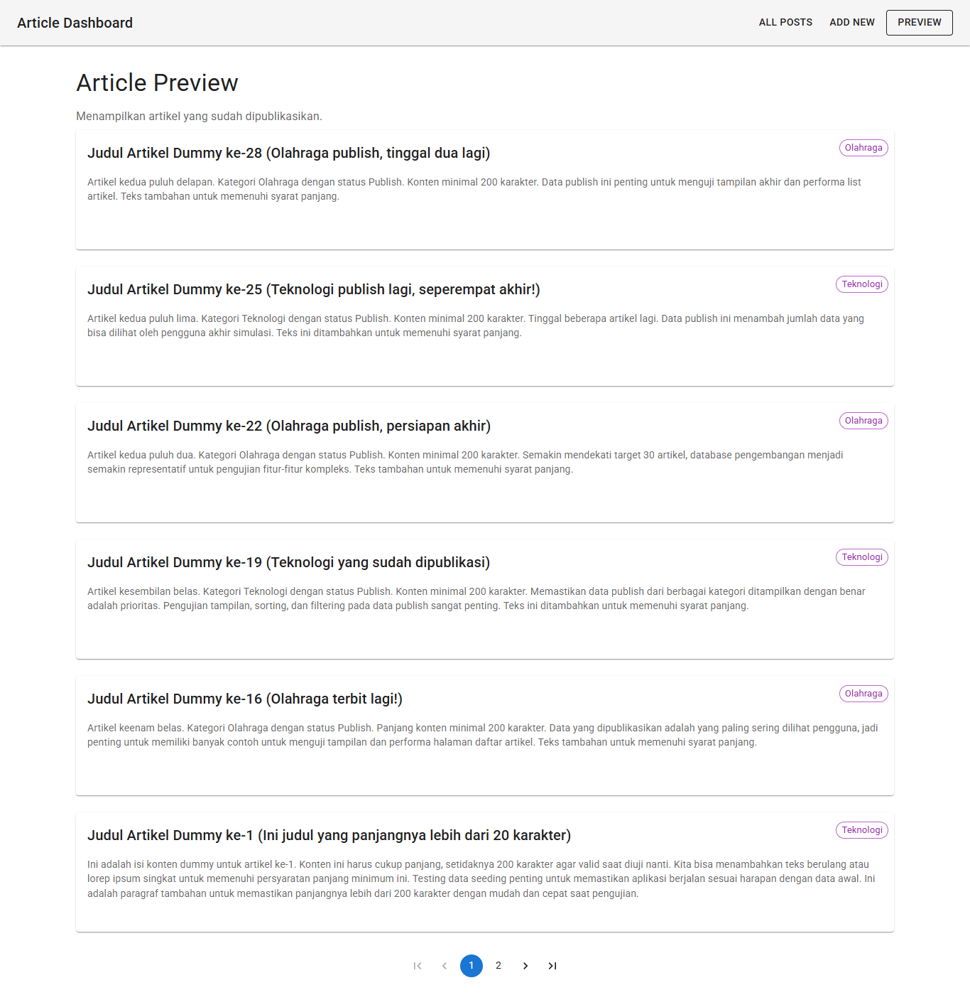
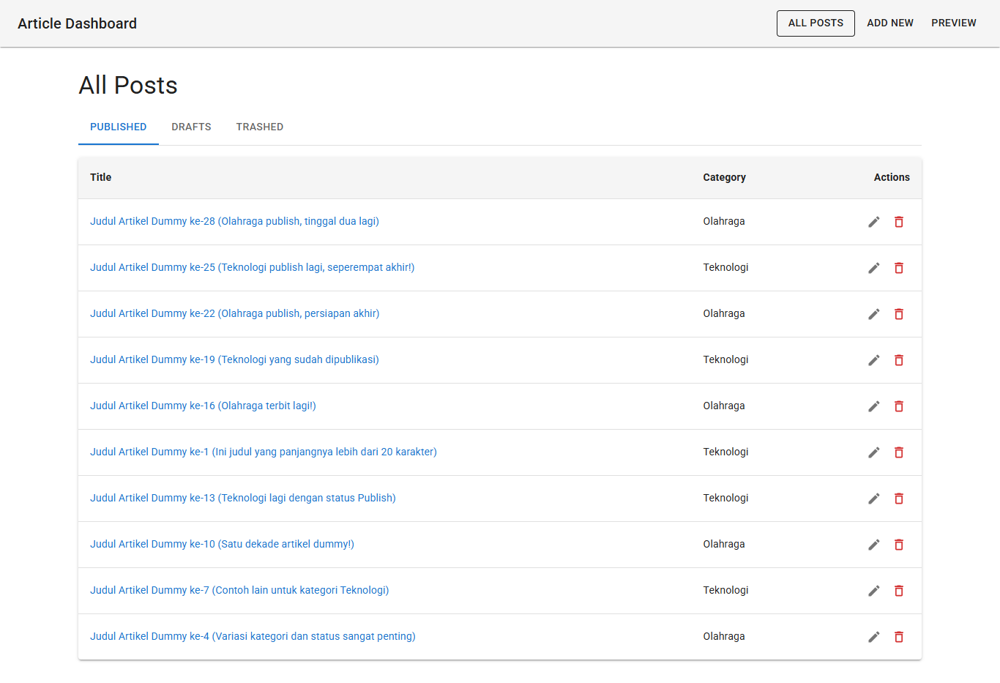

# React Article Client
Repository react-client Artikel ini dibuat oleh Muhammad Abdurrahman Firdaus sebagai kandidat Golang Developer di PT Sharing Vision Indonesia.
Repository ini berisi aplikasi frontend yang dibangun menggunakan React (dengan Vite) untuk berinteraksi dengan [Go Article API Microservice](https://github.com/daws11/go-article-api). Aplikasi ini memungkinkan pengguna untuk mengelola artikel (membuat, melihat, mengedit, memindahkan ke trash) dan melihat pratinjau artikel yang sudah dipublikasikan.

Proyek ini dibuat berdasarkan kebutuhan dari dokumen "Tes Frontend Sharing Vision 2023".
## Screenshot Aplikasi

Berikut adalah tampilan antarmuka aplikasi React Article Client:



## Technology Stack

* **Framework/Library:** React.js
* **Build Tool:** Vite
* **Routing:** React Router DOM (`react-router-dom`)
* **Permintaan API:** Axios (`axios`)
* **UI Library:** Material UI (MUI) (`@mui/material`, `@mui/icons-material`)
* **Styling:** Emotion (`@emotion/react`, `@emotion/styled`), CSS

## Fitur

* **Halaman "All Posts" (`/all-posts`):**
    * Menampilkan artikel dalam tab terpisah berdasarkan status: "Published", "Drafts", "Trashed".
    * Menyajikan daftar artikel dalam bentuk tabel (Kolom: Title, Category, Actions).
    * Tombol aksi pada setiap artikel untuk Edit (mengarahkan ke halaman edit) dan Trash (memindahkan artikel ke status 'Thrash').
    * **Catatan:** Penyaringan artikel berdasarkan status (tab) dilakukan di sisi frontend.
* **Halaman "Add New" (`/add-new`):**
    * Formulir untuk membuat artikel baru dengan input Title, Content, dan Category.
    * Tombol "Publish" dan "Save Draft" untuk mengirim artikel baru ke backend dengan status yang sesuai.
* **Halaman "Edit Post" (`/edit-post/:id`):**
    * Formulir untuk mengedit artikel yang sudah ada, terisi otomatis dengan data artikel yang dipilih.
    * Tombol "Update & Publish" dan "Update & Save Draft" untuk menyimpan perubahan ke backend.
* **Halaman "Preview" (`/preview`):**
    * Menampilkan daftar artikel dengan status "Publish" dalam format seperti blog (menggunakan Card).
    * Implementasi pagination untuk menavigasi antar halaman artikel yang dipublikasikan.
    * **Catatan:** Pagination diimplementasikan di sisi frontend.

## Ketergantungan Backend

Aplikasi frontend ini **memerlukan** [Go Article API Microservice](https://github.com/daws11/go-article-api) untuk berjalan dengan benar di latar belakang. Pastikan backend API berjalan dan dapat diakses.

Secara default, frontend dikonfigurasi untuk menghubungi backend di:
`http://localhost:8080/article`

Jika URL backend Anda berbeda, ubah nilai `API_BASE_URL` di file `src/api/config.js`.

## Prasyarat

* Node.js (Versi LTS direkomendasikan)
* npm atau yarn

## Pengaturan & Instalasi

1.  **Clone Repository:**
    ```bash
    git clone [https://github.com/daws11/react-article-client.git](https://github.com/daws11/react-article-client.git) 
    cd react-article-client
    ```

2.  **Instal Dependensi:**
    ```bash
    npm install
    # atau jika menggunakan yarn
    # yarn install
    ```

3.  **Konfigurasi URL Backend (jika perlu):**
    * Buka file `src/api/config.js`.
    * Ubah nilai `API_BASE_URL` agar sesuai dengan alamat API backend Go Anda jika berbeda dari default (`http://localhost:8080/article`).

4.  **Jalankan Backend:** Pastikan service backend Go Anda sedang berjalan.

5.  **Jalankan Server Pengembangan Frontend:**
    ```bash
    npm run dev
    # atau jika menggunakan yarn
    # yarn dev
    ```

## Menjalankan Aplikasi

Setelah server pengembangan berjalan, buka browser Anda dan akses alamat yang ditampilkan (biasanya `http://localhost:5173` atau port lain jika 5173 sudah digunakan).
